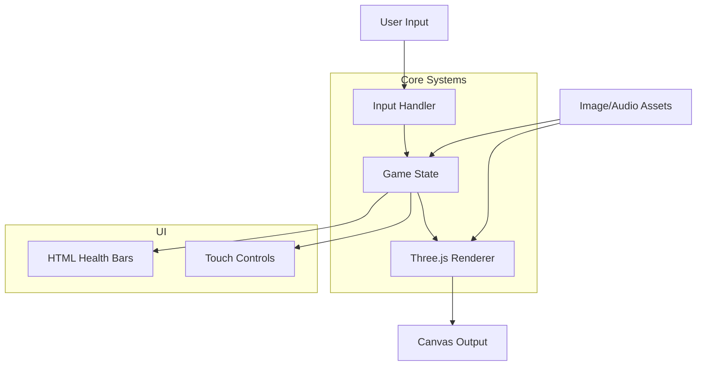

# System Patterns: Evelyn's Taekwondo Showdown

## System Architecture

* **Client-Side Game:** Runs entirely in browser using Three.js for 3D rendering
* **No Backend Logic:** server.py only used for local development serving
* **Core Components:**
  - Three.js scene management
  - Sprite-based character animation
  - HTML/CSS overlay for UI elements
  - Audio system using HTML5 Audio

## Key Technical Decisions

* **Game Engine:** Three.js for 3D rendering with 2D sprites
* **State Management:** Object-oriented approach with character state objects
* **Input Handling:** 
  - Keyboard controls for desktop
  - Touch controls for mobile devices
* **Animation System:**
  - Frame-by-frame sprite animation
  - Texture swapping for different actions
  - Smooth transitions between states

## Design Patterns

* **Game Loop:** RequestAnimationFrame-based update cycle
* **State Machine:** Manages game states (intro, gameplay, ending)
* **Object Pool:** For confetti particle effects
* **Observer Pattern:** Handles input events and game state changes

## Component Relationships

## Implementation Details

* **Character Animation:**
  - Multiple sprite sheets for different actions
  - Frame timing controlled by game loop
  - Hit detection using texture pixel analysis

* **Collision System:**
  - Pixel-perfect collision detection
  - Extended hit boxes for attacks
  - Damage calculation based on attack type

* **Audio System:**
  - Background music loop
  - Sound effects for actions
  - Mobile-friendly audio activation

*(This file outlines the technical structure and patterns, starting with observations from existing files.)*
